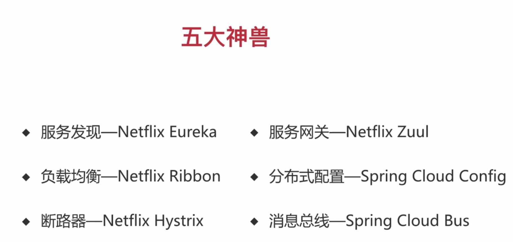

# 日志框架

## 框架能力

## 框架选择

## Logback 配置

> 配置文件

- application.yml : 简单配置
- logbask-spring.xml ： 复杂配置
 
# 结构

> DTO代表服务层需要接收的数据和返回的数据，而VO代表展示层需要显示的数据\

# 微信网络授权

code -> openid 

- 拼出来的连接，可以发给文件助手，在微信里面打开 

> 文档了解透彻(openid)

[官方文档](https://mp.weixin.qq.com/wiki)

[轮子](https://github.com/Wechat-Group/weixin-java-tools)

> 调试：

[内网穿透工具](https://natapp.cn)

# 微信支付

[官方文档](https://pay.weixin.qq.com/wiki)

[轮子](https://github.com/Pay-Group/best/-pay-sdk)

# 微信登录
[官方文档](https://open.weixin.qq.com)

# websocket

> 前后端连接，主动通信。 前端连接上后端的websocket，后端主动通过websocket发送消息

> 采用ws协议

# 压测工具 Apache ab

# redis

[redis 中文](http://redis.cn/)

## 分布式锁 SETNX

## 缓存

# 项目部署

centos7 service

# 课程总结

# 进阶：Spring Cloud 

# 抓包

> charles